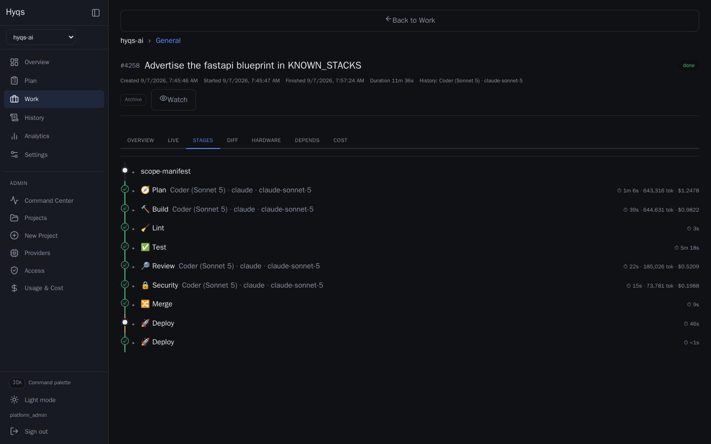

# Hyqs

A living, 24/7 personal AI agent built on the
[Claude Agent SDK](https://code.claude.com/docs/en/agent-sdk/python). It has two
faces that share one process:

1. **A conversational orchestrator** — you message it via the web console; it
   reasons, uses tools/skills, remembers things across messages, and acts
   proactively (reminders, background tasks).
2. **An autonomous build pipeline** — queue a job via the web UI and it plans, writes
   the code in an isolated git worktree, tests it, reviews it, and merges — on its
   own, self-healing on failure, pausing when rate-limited, and resuming after a
   reboot.



## Concept

```
Web console ──▶ router ──┬─▶ per-chat ClaudeSDKClient (persistent context)
                         │     ├─ built-in tools (file / shell / web)
                         │     ├─ in-process MCP tools (hyqs/tools/)  ← "capacities"
                         │     ├─ skills              (hyqs/skills/)  ← know-how
                         │     └─ durable memory       (sqlite)
                         │           └─▶ proactive reminders  (the "living" part)
                         │
  Web API job queue ─────┴─▶ pipeline runner (Postgres-backed, multi-host, resumable)
             QUEUED ▶ PLAN ▶ BUILD ▶ LINT ▶ TEST ▶ REVIEW ▶ SECURITY ▶ MERGE ▶ DEPLOY
                                      ╰────────▶ FIX ◀────────╯  (self-heal loop)
```

| Layer | Where | What |
|-------|-------|------|
| Orchestrator | `hyqs/core/` | Persistent agent session per chat + reminder scheduler |
| Tools | `hyqs/tools/` | In-process MCP servers (`@tool`) — add capabilities here |
| Skills | `hyqs/skills/` | Agent SDK skills (markdown) — the agent's know-how |
| Memory | `hyqs/memory/` | sqlite: facts + reminders |
| Pipeline | `hyqs/pipeline/` | The autonomous build runner, stages, and shared-Postgres job store |
| Web | `hyqs/web/` | Starlette JSON+SSE API + React console (chat + live jobs); also serves an MCP endpoint at `<base>/mcp` for driving the job queue from an agent client — see [`docs/mcp.md`](docs/mcp.md) for the tool list, connection and auth details |
| Deploy | `deploy/` | `systemd --user` unit for 24/7 operation |

## The build pipeline

`/build <idea>` queues a job that the runner (`hyqs/pipeline/runner.py`) advances
**one stage at a time**, persisting to Postgres after each so it's fully resumable:

| Stage | Who | What happens |
|-------|-----|--------------|
| **PLAN** | AI (read-only) | Inspects the repo, turns the idea into a minimal JSON plan. |
| **BUILD** | AI (coder) | Implements the plan in an isolated git **worktree**; the runner commits it. |
| **LINT** | Deterministic, no AI | Lockfile-sync check plus formatter/linter, scoped to the job's own diff. |
| **TEST** | Deterministic, no AI | Detects + runs the repo's test suite (Make/pytest/npm/cargo/go), then any project-defined `.hyqs/invariants/` regression checks. |
| **REVIEW** | AI (read-only) | Reviews the diff; emits a strict `pass`/`fail` verdict. |
| **SECURITY** | AI (read-only) | Audits the diff for introduced vulnerabilities; a security boundary is *executed*, not just diffed. |
| **DESIGN REVIEW** | AI (read-only) | UI changes only: checks the result against the project's design conventions. |
| **MERGE** | Deterministic | Merges to the base branch (optional `git push`), cleans up the worktree. |
| **DEPLOY** | Deterministic | Optional. Ships the merged commit — container build, health-gated cutover, nginx vhost. |

The merge gate is strict: a job only reaches MERGE by clearing **every** gate before
it — lint, tests, review, security, and design review where it applies. Any one of
them failing routes the job into FIX instead of forward.
All git plumbing is done by the runner (not the agent), so the irreversible steps
are predictable and auditable.

### Built for autonomy

- **Self-heal** — a failing TEST or REVIEW isn't the end. The failure is fed to a
  **FIX** agent that edits the worktree, then the job re-tests and re-reviews,
  bounded by `HYQS_PIPELINE_MAX_ATTEMPTS` before it gives up. A violated
  `.hyqs/invariants/` check routes into the same FIX loop as a failing test —
  past review/incident lessons become permanent, executable regression guards.
- **Rate-limit aware** — if a stage hits the Anthropic usage/rate limit, the runner
  reverts the job to its current stage and **pauses until the limit resets**, then
  resumes where it left off. This gate is pure deterministic Python — no AI — because
  AI is exactly what's unavailable when you're limited.
- **Crash / reboot safe** — job state is checkpointed to the shared Postgres after
  every stage, a dead worker's lease expires and its job is reclaimed by a peer,
  and even an active rate-limit pause is persisted, so a reboot resumes without
  losing its place.

## Requirements

| | |
|---|---|
| **Host** | A Debian or Ubuntu box you control — a VPS is the point, since it runs 24/7. The installer targets `apt`. |
| **RAM** | 4 GB runs one worker comfortably. Budget ~2 GB per additional concurrent worker, and **configure swap** — builds run `npm`/`pytest` and a host with no swap OOM-kills rather than slowing down. |
| **Disk** | 20 GB+. Docker build cache grows fast if you deploy containers; the janitor prunes it, but give it room. |
| **Python** | 3.11+ (the installer manages it via [uv](https://docs.astral.sh/uv/)). |
| **Node** | 20+, for the web console build. |
| **Docker** | For the Postgres coordination plane, and for deploying containerized projects. |
| **An Anthropic account** | Either a Claude subscription (Hyqs uses your logged-in `claude` CLI) or an `ANTHROPIC_API_KEY`. This is the one thing the installer cannot do for you. |

## Install on your own VPS

```bash
git clone https://github.com/clementmilville/hyqs.git ~/hyqs-ai
cd ~/hyqs-ai

# Localhost only — reach it through an SSH tunnel:
bash deploy/install.sh

# Put newly provisioned project repositories in your company organization:
bash deploy/install.sh --github-org acme-inc

# Or serve it publicly with nginx + Let's Encrypt TLS
# (point the DNS A/AAAA records at this host first):
bash deploy/install.sh --domain hyqs.example.com --email you@example.com --github-org acme-inc
```

The installer handles system packages, uv, the Claude CLI, Python and frontend
dependencies, a generated `.env` (fresh Postgres password, web token, admin
password and encryption key), the Postgres container, `systemd --user` services
with lingering enabled, and optionally the nginx vhost and certificate. It is
idempotent — re-run it after a failure and it resumes. It never overwrites an
existing `.env`.

On a first install, `--github-org <name>` writes `HYQS_GITHUB_ORG` to the
generated `.env`, so new project repositories are created in that organization.
The GitHub account authenticated with `gh` must have permission to create
repositories there. If the option is omitted in an interactive terminal, the
installer asks for it; leaving the answer empty uses the authenticated user's
personal namespace. In non-interactive/scripted runs, omission defaults to the
same empty personal-account setting without reading stdin. Installer reruns
leave an existing `.env` untouched, even when `--github-org` is supplied.

GitHub CLI authentication is needed only when provisioning project repositories,
not to install or run Hyqs. The installer checks `gh auth status` and emits a
warning if `gh` is missing or unauthenticated, but continues the installation.

Two things to do afterwards, which it will remind you about:

1. **Authenticate an agent** — run `claude` once to sign in, or set
   `ANTHROPIC_API_KEY` in `.env`. Nothing can build until you do.
2. **Back up `HYQS_CREDENTIAL_ENCRYPTION_KEY`** from `.env`. It encrypts stored
   third-party credentials; lose it and they are unrecoverable.

Then sign in with the generated admin account, point a project at a git repo,
and queue a job.

### Running it by hand

```bash
uv sync                                     # install deps into .venv
cp .env.example .env                        # then fill in your settings
docker compose --env-file .env -f deploy/docker-compose.yml up -d
npm --prefix hyqs/web/frontend ci && npm --prefix hyqs/web/frontend run build
uv run hyqs                                 # start the agent (web + pipeline)
```

`.env.example` documents every setting. The minimum for a working install is
`POSTGRES_PASSWORD`, a matching `HYQS_DB_URL`, and `HYQS_ADMIN_EMAIL` /
`HYQS_ADMIN_PASSWORD` — the last two create the first account on startup, and
without them there is no way to sign in.

The console is served at `http://<HYQS_WEB_HOST>:<HYQS_WEB_PORT>` (default
`127.0.0.1:8787`). The full daemon serves it, or run it standalone with
`hyqs-web` — handy for just watching pipeline jobs and usage.

Already have jobs in an old local `data/pipeline.db`? Carry them into Postgres
once with `uv run hyqs-migrate-sqlite`.

## Configuration

All settings are environment variables (see [`.env.example`](.env.example) for the
full list with comments). The most relevant:

| Variable | Purpose |
|----------|---------|
| `HYQS_DB_URL` (or `DATABASE_URL`) | Shared Postgres DSN for the build pipeline (required for builds) |
| `HYQS_MODEL`, `HYQS_PIPELINE_MODEL` | Model for chat / for pipeline stages |
| `HYQS_PERMISSION_MODE` | How much the agent runs unattended |
| `HYQS_DEFAULT_REPO`, `HYQS_GIT_PUSH` | Default target repo for builds; push after merge |
| `HYQS_PIPELINE_MAX_ATTEMPTS` | Fix→retest→re-review rounds before giving up |
| `HYQS_PIPELINE_STAGE_TIMEOUT` | Hard cap (seconds) on a single AI stage |
| `HYQS_PIPELINE_LIMIT_BACKOFF` | Pause length when rate-limited without a reset time |
| `HYQS_WEB_*` | Web console host/port/token, or disable it |

## Run 24/7

See [`deploy/`](deploy/) for `systemd --user` services that auto-restart and
survive logout/reboot. By default one process runs everything; you can also run
the **build pipeline as its own worker** (`hyqs-pipeline` /
`deploy/hyqs-pipeline.service`) so it lives independently of the chat layer — set
`HYQS_PIPELINE_DISABLED=1` on the daemon and start the worker separately.

## Security

**Hyqs executes code on the host it runs on.** That is the product, not a
side effect — the chat agent has shell and file tools, and the pipeline runs
builds with `bypassPermissions` inside isolated git worktrees. Treat an
instance as equivalent to shell access for everyone who can sign in.

What that means in practice:

- **Give it its own unprivileged user and its own box.** The installer refuses
  to run as root for this reason. Don't co-locate it with anything you'd mind
  a bad generation touching.
- **Never expose the port directly.** The installer binds `127.0.0.1` and only
  serves publicly behind nginx with TLS. Without a domain, reach it over an SSH
  tunnel: `ssh -L 8787:127.0.0.1:8787 user@host`.
- **Accounts are invite-only.** There is no public sign-up, and OAuth never
  auto-provisions — it only matches an existing user or a pending invitation.
- **The console chat is admin-only.** It reaches an agent with shell tools, so
  it requires the platform-wide `admin_console` permission. A project role does
  not carry it, and a project-scoped API token can never satisfy it.
- **`HYQS_PERMISSION_MODE`** controls how much the chat agent does unattended.
  Read the comments in `.env.example` before choosing `bypassPermissions`.

Hyqs is designed for a **trusted, closed set of users on a single-tenant host**.
Project members can influence what builds run and what gets deployed, so
everyone with an account should be someone you'd trust with the machine. It is
not hardened for untrusted multi-tenancy — don't run other people's
repositories on an instance you care about.

Found a security issue? Please report it privately through
[GitHub Security Advisories](https://github.com/clementmilville/hyqs/security/advisories/new)
rather than opening a public issue. See [`SECURITY.md`](SECURITY.md).

## License

[MIT](LICENSE).
